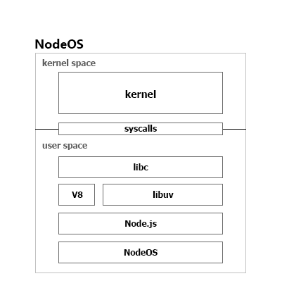
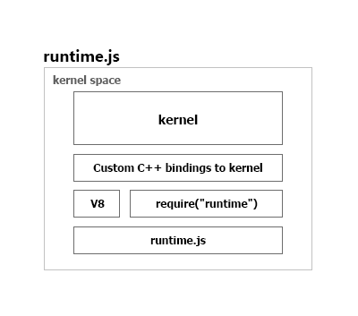
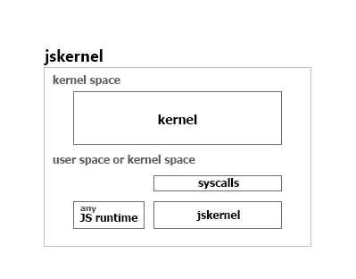

# JavaScript Exo-kernels

Besides [jskernel](../README.md) there are at least two other projects that
work towards creating an exo-kernel in Javascript:

 - [NodeOS](https://node-os.com/)
 - [runtime.js](http://runtimejs.org/)

See below comparison of their architecture designs with `jskernel`. The
below is by no means a correct representation, it is just how I understand it.

## NodeOS

*NodeOS* isn't actually an exo-kernel, but an operating system. It works similarly
like you would run your typical Node.js apps with the difference that, when the NodeOS
starts, it boots directly into node's REPL prompt as the main process (of course, its more complex than that in reality). So, you
don't have BASH and other utilities that you are used to on Linux, but you
are immediately thrown into a JS runtime.

*Notes:*

 1. It is fully Node.js compatible, so you can use your `npm` and other tools
 you are used to.
 2. However, it is not much different than simply running Node.js, except that the OS image is much smaller.
 3. All Node.js dependencies come with it: *V8*, *libuv*, *libc*, etc.

## runtime.js

*runtime.js* is a proper exo-kernel, it is baked directly into the Linux kernel together
with V8.

*Notes:*

 1. Gives you a direct access to kernel/hardware.
 1. Does not use libc, libuv, Node.js; so it is not yet Node.js compatible,
 you cannot use `npm` or any other tools you are used to.
 2. Heavy integration with V8.

## jskernel

The `jskernel` proposal is to execute [System calls](https://en.wikipedia.org/wiki/System_call)
directly from JavaScript.

*Notes:*
 1. *Zero* native dependencies.
 2. Use any JS interpreter.
 3. [`unode`](http://www.npmjs.com/package/unode) will provide Node.js compatible API.
 4. Can be used in kernel space or user space.
 5. The only dependency is the `syscall` function.
 6. Written completely in JavaScript.
